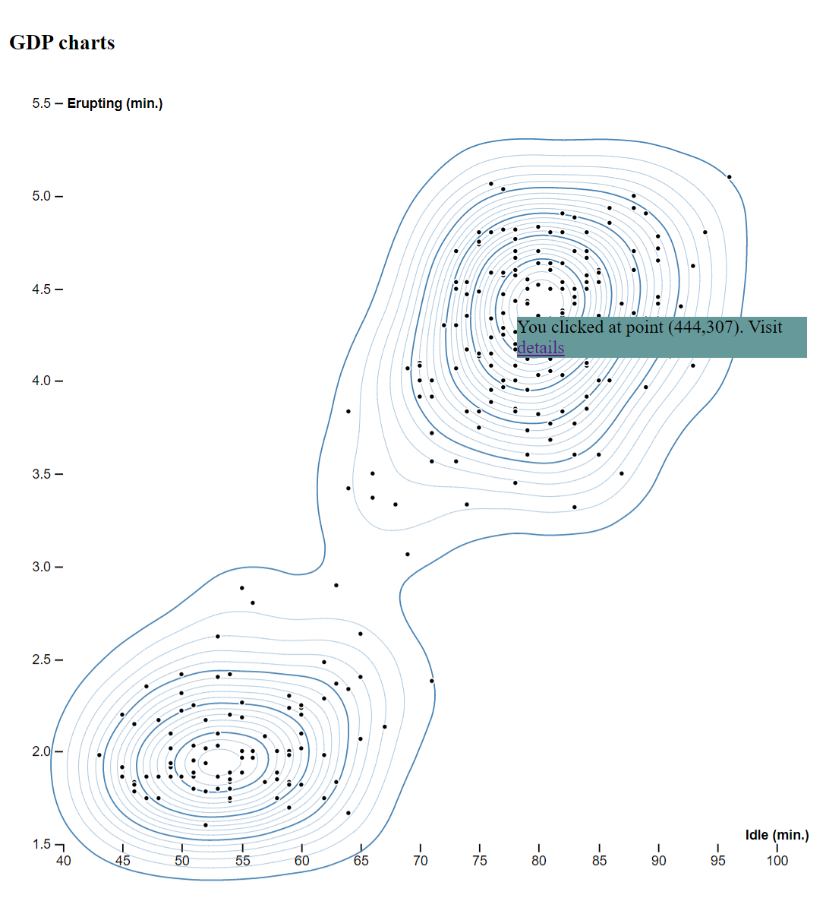

# VueJS and D3.js

Simple examples to learn about D3.js (business data) with VueJs.
VueJS is an interactive UI framework with D3.js for visualization of business data.

## Examples

* Contours

* Arc

